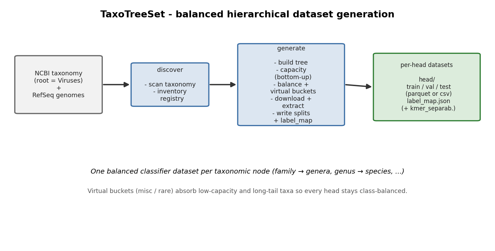
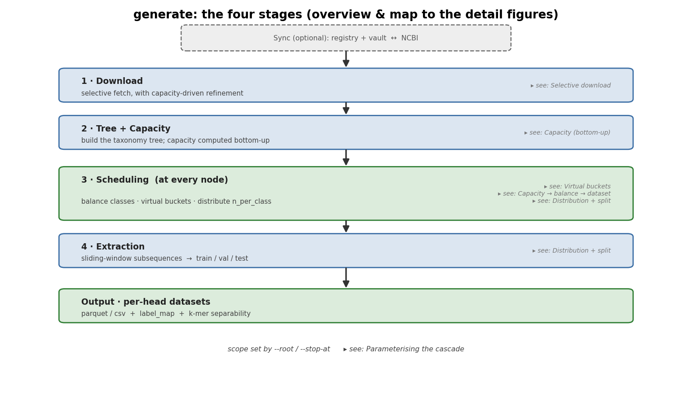
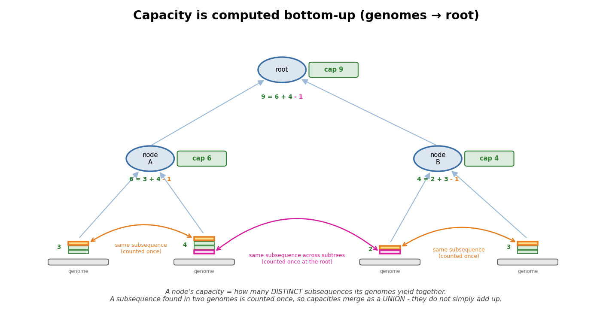
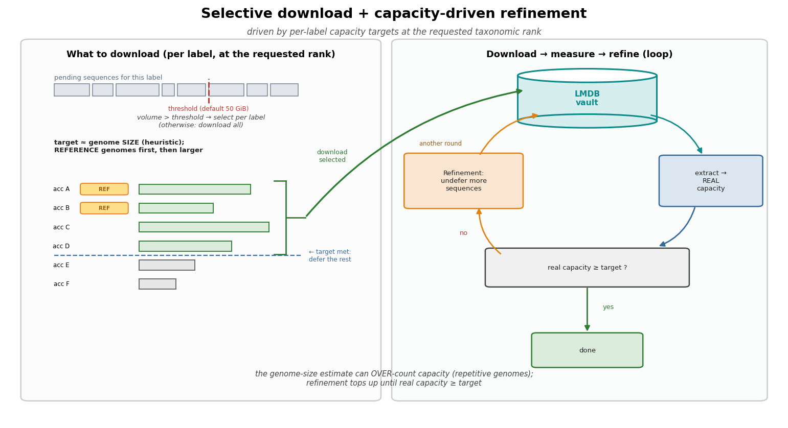
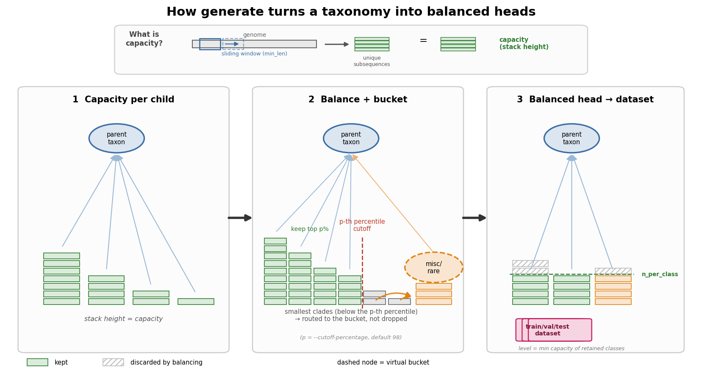
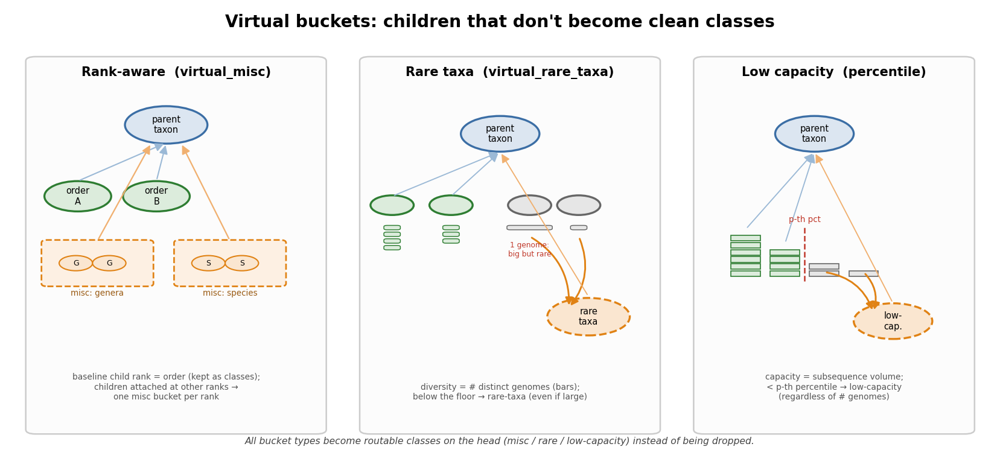
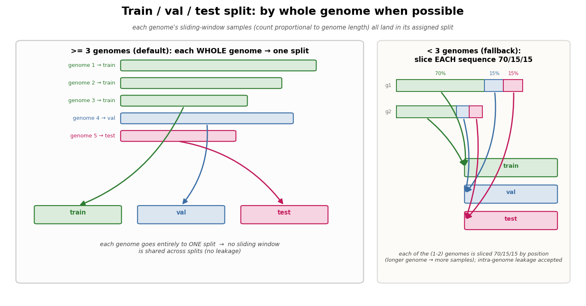
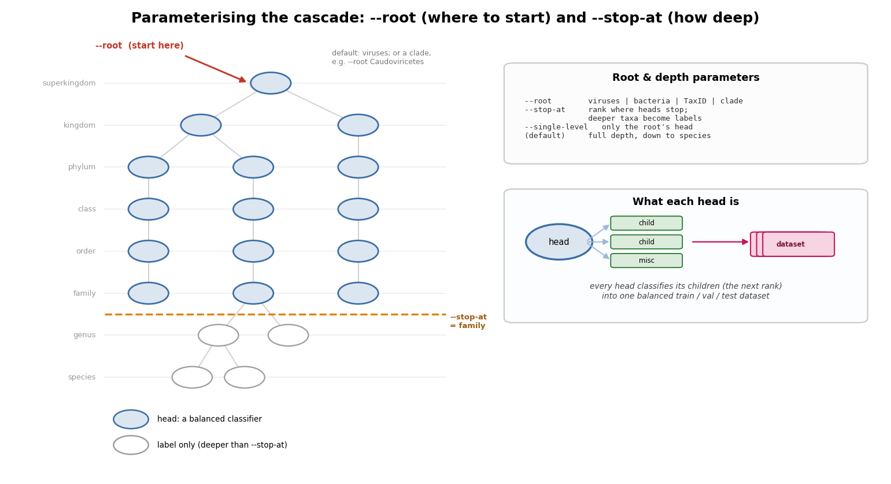

# TaxoTreeSet

TaxoTreeSet builds balanced, hierarchically structured training datasets from
NCBI Virus RefSeq for cascaded LoRA fine-tuning of genomic language models. It
turns a raw catalog of viral genome sequences into a tree of
per-decision-point training shards (one per classifier head), each ready to
train a LoRA adapter on top of a foundation model backbone such as DNABERT-2.

## Overview

A single flat classifier over thousands of viral taxa is impractical to train
and to interpret. TaxoTreeSet instead mirrors the NCBI taxonomy as a cascade of
small classifiers: each internal taxonomic node becomes a *head* that
discriminates only among its direct children. At inference time, a sequence is
routed down the tree head by head until it reaches the most specific
confidently predicted taxon.

Producing such a cascade from real taxonomy is not mechanical. NCBI Taxonomy is
irregular -- sibling nodes can carry different ranks, clades vary in sampling
depth by orders of magnitude, and the post-ICTV-2022 reorganization left many
viral genera orphaned without a family. TaxoTreeSet contains the machinery to
turn this messy input into balanced, trainable heads: rank-aware bucketing,
capacity-based balancing, a leaf-count cardinality threshold, and curated
semantic fallbacks. Each mechanism is documented in `docs/GLOSSARY.md`.

The output format (Parquet shards of subsequence/label pairs plus JSON
manifests) is model-agnostic; DNABERT-2 is the reference backbone but the
datasets can train any sequence classifier.

## Installation

### TaxoTreeSet

TaxoTreeSet requires **Python 3.11**. Install it from source:

```
git clone https://github.com/andreyfsch/TaxoTreeSet.git
cd TaxoTreeSet
pip install -e .
```

This pulls the runtime dependencies: `bigtree` (tree construction), `taxoniq`
(local NCBI Taxonomy lineage resolution), `numpy`, `pyarrow` (Parquet output),
`lmdb` (sequence vault), and `zstandard` (vault compression). The optional k-mer
separability diagnostic additionally needs scikit-learn:

```
pip install -e ".[diagnose]"
```

### NCBI Datasets CLI (required)

TaxoTreeSet drives NCBI's official **Datasets** command-line tool — the
`datasets` binary — to list assemblies (`datasets summary`) and download genomes
(`datasets download`). It is an external program, **not** a Python package, and
must be on your `PATH`. The simplest install is via conda:

```
conda install -c conda-forge ncbi-datasets-cli
```

Alternatively, download the standalone binary for your platform following the
[NCBI Datasets v2 documentation](https://www.ncbi.nlm.nih.gov/datasets/docs/v2/).
Confirm the shell can find it before continuing:

```
datasets --version
```

### NCBI API key (required in practice)

NCBI throttles anonymous Datasets traffic to about 3 requests per second; a
personal API key raises that to about 10/s. Because discovering even a modest
clade issues thousands of metadata requests, **a key is effectively required** —
without one the scan is painfully slow and NCBI may begin rejecting requests.
Create a key from your NCBI account (sign in, then **Account settings → API Key
Management**) and export it in the shell before running TaxoTreeSet:

```
export NCBI_API_KEY=your_key_here
```

Add that line to your `~/.bashrc` or `~/.zshrc` to make it persistent.
TaxoTreeSet forwards the variable to every `datasets` subprocess automatically
and logs at startup whether a key was detected.

## Quickstart

The two stages run back to back. The example uses **Coronaviridae** (TaxID
`11118`), a small RefSeq-curated family that downloads quickly; substitute any
TaxID or clade for your own scope.

```
export NCBI_API_KEY=your_key_here

# 1. Scan NCBI and cache the clade's RefSeq genomes in the LMDB vault
python3 -m taxotreeset discover --taxon-id 11118

# 2. Build the balanced, per-head train/val/test datasets
python3 -m taxotreeset generate --root 11118 --output data/datasets
```

The first command contacts NCBI and downloads genomes, so its runtime scales
with the clade (very large scopes are bounded by selective download). The second
writes a directory tree of heads under `data/datasets/`, each containing
`train.parquet` / `val.parquet` / `test.parquet` and a `label_map.json`:

```
find data/datasets -name '*.parquet' | head
```

To start higher, stop earlier, or generate a single head, see
[Parameterizing the cascade](#parameterizing-the-cascade)
(`--root`, `--stop-at`, `--single-level`).

## How it works

TaxoTreeSet has two entry points. `discover` scans NCBI taxonomy from a root
and builds an inventory registry; `generate` turns that registry into a tree of
balanced, per-head datasets. Sequence data lives in an LMDB vault, kept separate
from the registry metadata.



### The four stages of `generate`

After an optional sync of the registry and vault against NCBI, `generate` runs
four stages. The map below points to the mechanism each stage relies on; the
following sections explain them in turn.



### Capacity, computed bottom-up



A node's **capacity** is the number of *distinct* sliding-window subsequences
(of length ≥ `min_len`) extractable from all genomes beneath it. Because the
same subsequence can occur in sibling genomes, capacity is the size of the
**union** of their subsequences — a shared window is counted once — so a
parent's capacity is at most the sum of its children's, never more. Capacity is
the currency of every balancing decision. It is computed exactly with a
memory-bounded union, or approximately with a Bloom filter
(`--approximate-capacity`, ~1 % error), and cached in the registry so reruns are
cheap.

### Selective download with capacity-driven refinement



Downloading every RefSeq genome is wasteful when only a fraction is needed to
balance the heads. When the total pending volume exceeds a threshold (default
50 GiB, parameterizable), TaxoTreeSet selects — *per label* and only for the
labels of the requested rank — the genomes needed to reach that label's capacity
target: **reference assemblies first**, then by decreasing size, until the
target is met; the rest are deferred. Because the genome-size estimate is a
heuristic that can over-count capacity (repetitive genomes inflate it), a
**refinement loop** measures the *real* capacity after extraction and undefers
additional genomes for any label that fell short, repeating until every target
is satisfied or its deferred pool is exhausted. Downloaded sequences land in the
LMDB vault.

### Per-class balancing and the percentile cutoff



At each node the sibling classes are balanced so the head does not learn priors
skewed toward better-sequenced clades. `n_per_class` is set to the smallest
capacity among the *retained* classes. When at least one child falls below
`--min-num-seqs`, the children are sorted by capacity and the smallest tail
(below the p-th percentile — `--cutoff-percentage`, default 98) is routed into a
bucket rather than allowed to drag `n_per_class` down. The tail is therefore
**routed, not dropped**, and every retained class is sampled to the same
`n_per_class`.

### Virtual buckets



Children that cannot become clean classes are absorbed into **virtual buckets**
— routable classes on the head — instead of being discarded. Three distinct
mechanisms produce them:

- **Rank-aware (`virtual_misc`)** — when a node's children carry heterogeneous
  ranks, the off-baseline ranks are grouped into one bucket *per rank* (for
  example, genera and species attached directly under a class get a genera
  bucket and a species bucket). A non-canonical rank needs at least
  `--min-subclades-per-bucket` members to earn its own bucket.
- **Rare-taxa (`virtual_rare_taxa`)** — children with too few distinct genomes
  (below `--min-leaves-per-class`) lack the *diversity* to train a class. This
  is independent of capacity: a single very large genome is high-capacity yet
  still rare, because it is one source.
- **Low-capacity** — the percentile-cutoff tail above merges here so it cannot
  starve the head.

### Splitting: whole genomes, leakage-safe



The per-class budget is distributed across a class's genomes in proportion to
their length, so longer genomes contribute more windows. The train/val/test
split is **by whole genome** whenever a class has at least three genomes: each
genome is assigned entirely to a single split, so no sliding window is ever
shared between splits — there is no leakage. Only when a class has fewer than
three genomes does it fall back to slicing a single sequence positionally
(70 / 15 / 15), accepting some intra-genome leakage as the price of having any
data at all for that class.

### Parameterizing the cascade



Two parameters shape the generated cascade. `--root` chooses where it starts: a
domain shortcut (`viruses`, `bacteria`, `archaea`, `eukaryotes`), a numeric NCBI
TaxID, or a clade scientific name (e.g. `Caudoviricetes`). `--stop-at` chooses
how deep heads are created — nodes deeper than the given canonical rank still
become training labels, but not heads of their own — while `--single-level`
generates only the root's head. Every node from `--root` down to `--stop-at`
becomes one balanced classifier; each head classifies its direct children into a
single balanced train/val/test dataset.

The figures above are generated, reproducibly and from no external data, by
`python docs/make_figures.py`.

## Workflow

TaxoTreeSet runs in two stages, each with its own entry point.

### Stage 1: Discovery

`taxotreeset discover` queries NCBI from a biological root TaxID, applies the
configured scope mapping, and writes an inventory (`registry.json`) plus the
downloaded sequences into the LMDB vault.

```
python3 -m taxotreeset discover --taxon-id 10239
```

Key options:

| Option            | Default               | Purpose                                          |
|-------------------|-----------------------|--------------------------------------------------|
| `--taxon-id, -t`  | 10239 (Viruses)       | NCBI TaxID of the biological root                |
| `--mapping, -m`   | configs/mapping.json  | Scope and fallback redirection rules             |
| `--registry, -r`  | XDG data dir          | Destination inventory file                       |
| `--reset, -f`     | off                   | Delete the old registry before a fresh discovery |

### Stage 2: Generation

`taxotreeset generate` builds the taxonomic tree from the registry, runs the
decision-point cascade to decide heads, buckets, and passthroughs, and writes
the balanced Parquet shards plus the sidecar manifests.

```
python3 -m taxotreeset generate --root viruses
```

Key options:

| Option                   | Default       | Purpose                                                        |
|--------------------------|---------------|----------------------------------------------------------------|
| `--root, -g`             | viruses       | Where the cascade starts: domain shortcut, NCBI TaxID, or clade name |
| `--stop-at`              | (deepest)     | Canonical rank where heads stop; deeper taxa become labels only |
| `--single-level`         | off           | Generate only the root's head (no recursion into children)     |
| `--output, -o`           | data/datasets | Output directory for shards and manifests                      |
| `--max-subseq-len, -w`   | 2000          | Sliding-window size (bp) for subsequence extraction            |
| `--approximate-capacity` | off           | Bloom filter for capacity (~12MB, ~1% error); default is exact, memory-bounded |
| `--min-num-seqs`         | 1000          | Below this per-class capacity, the cutoff scenario triggers    |
| `--cutoff-percentage`    | 98.0          | Percentile of children retained when cutoff applies            |
| `--max-n-per-class`      | 20000         | Hard ceiling on subseqs per class                              |
| `--min-leaves-per-class` | 3             | Minimum sequence leaves for a child to stay a standalone class |
| `--rare-taxa-strategy`   | fallback      | `fallback` (divert rare taxa) or `keep` (retain all classes)   |

Behind these options, the per-head mechanics are illustrated in
[How it works](#how-it-works): `--root` / `--stop-at` / `--single-level` shape
the cascade ([Parameterizing the cascade](#parameterizing-the-cascade));
`--approximate-capacity` toggles how
[capacity](#capacity-computed-bottom-up) is measured; `--min-num-seqs`,
`--cutoff-percentage` and `--max-n-per-class` drive
[per-class balancing and the percentile cutoff](#per-class-balancing-and-the-percentile-cutoff);
`--min-leaves-per-class` and `--rare-taxa-strategy` govern the
[virtual buckets](#virtual-buckets); and `--max-subseq-len` sets the window for
[extraction and the leakage-safe split](#splitting-whole-genomes-leakage-safe).
What actually gets downloaded is decided by
[selective download with capacity-driven refinement](#selective-download-with-capacity-driven-refinement).

## Output

Stage 2 produces, under the output directory:

- `train.parquet` / `val.parquet` / `test.parquet` per head, each with columns
  `seq` (string) and `class_idx` (int32), under a directory tree mirroring the
  taxonomy.
- `manifest_<domain>.json`: every head with its labels, scenario, per-class
  count, and leaf count.
- `passthroughs_<domain>.json`: single-child nodes redirected to their child.
- `virtual_id_registry_<domain>.json`: catalog of synthetic buckets, their
  parents, and absorbed taxa.

These three JSON files are the contract with downstream training and evaluation
code.

### What a head looks like

A single head directory — here `Coronaviridae`, reached at
`.../76804/11118/` — contains its three shards and a label map:

```
11118/
├── train.parquet
├── val.parquet
├── test.parquet
└── label_map.json
```

`label_map.json` is self-contained: it names every integer class index,
including the two virtual buckets the balancer introduced (note their synthetic
TaxIDs and virtual ranks):

```json
{
  "head_taxid": "11118",
  "head_name": "Coronaviridae",
  "head_rank": "family",
  "id2label": {
    "0": "Alphacoronavirus",
    "1": "Betacoronavirus",
    "2": "Gammacoronavirus",
    "3": "Deltacoronavirus",
    "4": "virtual_misc_Coronaviridae",
    "5": "virtual_rare_taxa_Coronaviridae"
  },
  "classes": [
    {"class_idx": 0, "taxid": "693996",    "name": "Alphacoronavirus",                "rank": "genus"},
    {"class_idx": 1, "taxid": "694002",    "name": "Betacoronavirus",                 "rank": "genus"},
    {"class_idx": 2, "taxid": "694013",    "name": "Gammacoronavirus",                "rank": "genus"},
    {"class_idx": 3, "taxid": "1159901",   "name": "Deltacoronavirus",                "rank": "genus"},
    {"class_idx": 4, "taxid": "948922171", "name": "virtual_misc_Coronaviridae",      "rank": "virtual_misc"},
    {"class_idx": 5, "taxid": "904115526", "name": "virtual_rare_taxa_Coronaviridae", "rank": "virtual_rare_taxa"}
  ]
}
```

Each shard pairs one subsequence with its class index (`seq` shown truncated;
subsequences vary in length up to `--max-subseq-len`):

| `class_idx` | `seq`                                       |
|-------------|---------------------------------------------|
| 0           | `GCTATTATACCTGCTGCT…CAAGATGCTGAT` (138 bp)   |
| 0           | `TTGAACTTGAACCTCCAT…GTTAGGCTCAAA` (709 bp)   |
| 1           | `ACGCAGCTAAAGTGACTG…CAGTTGTGGTAA` (1917 bp)  |

Running `taxotreeset separability` afterward adds a `kmer_separability` block to
each `label_map.json` (a quick estimate of how learnable the head is); plain
`generate` does not write it.

## Example: fine-tuning a head

`examples/finetune_head.py` is a reference consumer of the generated shards: it
fine-tunes a LoRA adapter on top of DNABERT-2 for a single head and writes the
adapter, `metrics.json`, and `run_config.json`.

It is **not part of the `taxotreeset` package** and is deliberately excluded
from the package's dependencies — training pulls in a heavy, hardware-specific
stack (PyTorch, Transformers, PEFT, ...) that has no place in a data-generation
tool. Install those separately in your own environment:

```
pip install torch torchvision torchaudio --index-url https://download.pytorch.org/whl/cu124
pip install transformers peft datasets scikit-learn accelerate sentencepiece
```

```
python examples/finetune_head.py \
    --data-dir   data/datasets/<lineage>/<taxid> \
    --output-dir runs/<taxid>
```

The data directory is any head directory produced by `generate` (it must contain
`train.parquet` / `val.parquet` / `test.parquet` with columns `seq` and
`class_idx`). Treat the script as a starting point: copy it into your own project
and adapt the backbone, hyperparameters, and dependencies for real runs.

## Architecture

The cascade is a recursive top-down traversal of the taxonomy. For each node it
classifies children by rank, estimates each child's capacity, computes a
balanced extraction plan, materializes any virtual buckets, distributes the
per-class sample budget across leaves, stratifies into train/val/test, records
the head in the manifest, and recurses into canonical children. Each of these
steps is illustrated in [How it works](#how-it-works) — see
[capacity](#capacity-computed-bottom-up),
[balancing and the percentile cutoff](#per-class-balancing-and-the-percentile-cutoff),
[virtual buckets](#virtual-buckets), and the
[leakage-safe split](#splitting-whole-genomes-leakage-safe). The core terms
(head, bucket, passthrough, capacity, cascade terminator) are defined in
`docs/GLOSSARY.md`.

## Documentation

- `docs/GLOSSARY.md` -- authoritative definitions of all technical terms
- `docs/PLANS/caudoviricetes_cardinality.md` -- diagnosis and rationale for the
  rare-taxa cardinality threshold
- `docs/PLANS/cami_evaluation_plan.md` -- evaluation plan against CAMI II and
  external tools
- `configs/README.md` -- configuration file reference
