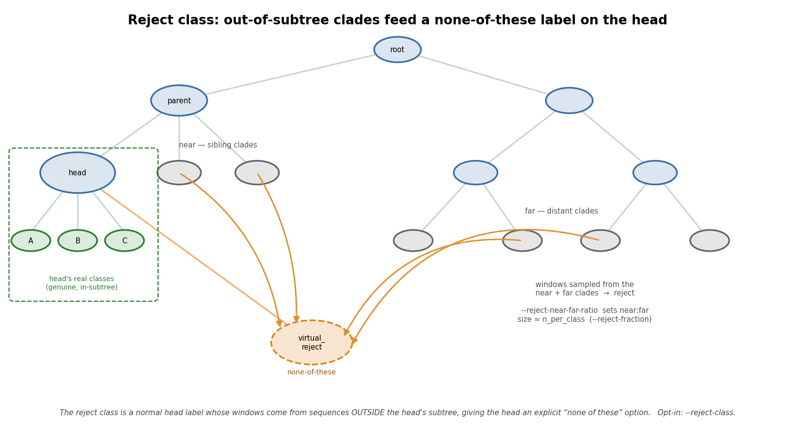
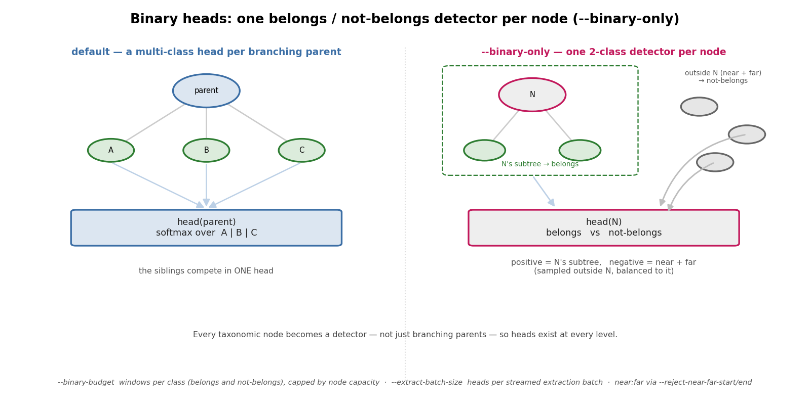
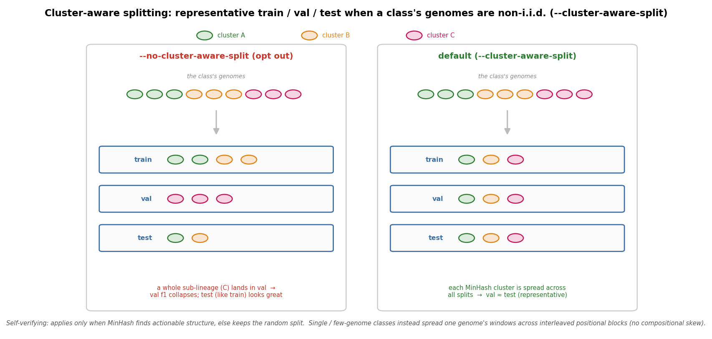
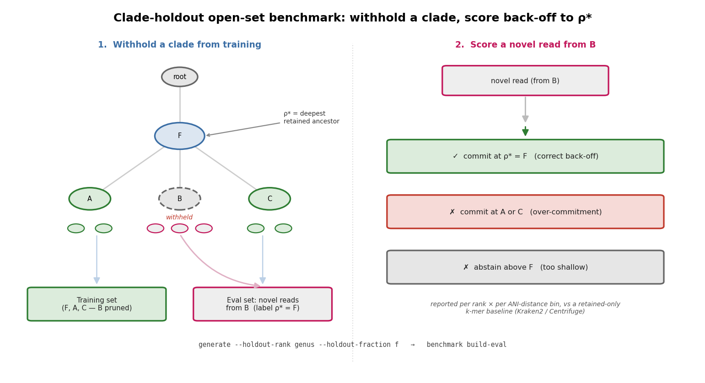

# TaxoTreeSet

TaxoTreeSet builds balanced, hierarchically structured training datasets from
NCBI RefSeq for LoRA fine-tuning of genomic language models. It turns a raw
catalog of genome sequences into a tree of per-node training shards — one
dataset for each internal taxonomic node, classifying that node's direct
children — each ready to train a LoRA adapter on top of a foundation model
backbone such as [DNABERT-2](https://github.com/MAGICS-LAB/DNABERT_2).

## Overview

A single flat classifier over thousands of taxa is impractical to train and to
interpret. TaxoTreeSet instead decomposes the problem along the NCBI taxonomy:
each internal taxonomic node becomes its own training set — a *head* that
discriminates only among that node's direct children — so one thousand-way
problem becomes many small, independently trainable ones.

Producing such datasets from real taxonomy is not mechanical. NCBI Taxonomy is
irregular -- sibling nodes can carry different ranks, clades vary in sampling
depth by orders of magnitude, and the post-ICTV-2022 reorganization left many
viral genera orphaned without a family. TaxoTreeSet contains the machinery to
turn this messy input into balanced, trainable heads: rank-aware bucketing,
capacity-based balancing, a leaf-count cardinality threshold, and curated
semantic fallbacks. Each mechanism is documented in `docs/GLOSSARY.md`.

The output format (Parquet shards of subsequence/label pairs plus JSON
manifests) is model-agnostic; [DNABERT-2](https://github.com/MAGICS-LAB/DNABERT_2) is the reference backbone but the
datasets can train any sequence classifier.

## Installation

### TaxoTreeSet

TaxoTreeSet requires **Python 3.11**. Install it from source:

```
git clone https://github.com/andreyfsch/TaxoTreeSet.git
cd TaxoTreeSet
pip install -e .
```

This pulls the runtime dependencies: `bigtree` (tree construction), `taxoniq`
(local NCBI Taxonomy lineage resolution), `numpy`, `pyarrow` (Parquet output),
`lmdb` (sequence vault), and `zstandard` (vault compression). The optional k-mer
separability diagnostic additionally needs scikit-learn:

```
pip install -e ".[diagnose]"
```

### NCBI Datasets CLI (required)

TaxoTreeSet drives NCBI's official **Datasets** command-line tool — the
`datasets` binary — to list assemblies (`datasets summary`) and download genomes
(`datasets download`). It is an external program, **not** a Python package, and
must be on your `PATH`. The simplest install is via conda:

```
conda install -c conda-forge ncbi-datasets-cli
```

Alternatively, download the standalone binary for your platform following the
[NCBI Datasets v2 documentation](https://www.ncbi.nlm.nih.gov/datasets/docs/v2/).
Confirm the shell can find it before continuing:

```
datasets --version
```

### NCBI API key (required in practice)

NCBI throttles anonymous Datasets traffic to about 3 requests per second; a
personal API key raises that to about 10/s. Because discovering even a modest
clade issues thousands of metadata requests, **a key is effectively required** —
without one the scan is painfully slow and NCBI may begin rejecting requests.
Create a key from your NCBI account (sign in, then **Account settings → API Key
Management**) and export it in the shell before running TaxoTreeSet:

```
export NCBI_API_KEY=your_key_here
```

Add that line to your `~/.bashrc` or `~/.zshrc` to make it persistent.
TaxoTreeSet forwards the variable to every `datasets` subprocess automatically
and logs at startup whether a key was detected.

## Quickstart

The two stages run back to back. The example uses **Coronaviridae** (TaxID
`11118`), a small RefSeq-curated family that downloads quickly; substitute any
TaxID or clade for your own scope.

```
export NCBI_API_KEY=your_key_here

# 1. Scan NCBI and cache the clade's RefSeq genomes in the LMDB vault
python3 -m taxotreeset discover --taxon-id 11118

# 2. Build the balanced, per-head train/val/test datasets
python3 -m taxotreeset generate --root 11118 --output data/datasets
```

The first command contacts NCBI and downloads genomes, so its runtime scales
with the clade (very large scopes are bounded by selective download). The second
writes a directory tree of heads under `data/datasets/`, each containing
`train.parquet` / `val.parquet` / `test.parquet` and a `label_map.json`:

```
find data/datasets -name '*.parquet' | head
```

To start higher, stop earlier, or generate a single head, see
[Parameterizing generation](#parameterizing-generation)
(`--root`, `--stop-at`, `--single-level`).

## How it works

TaxoTreeSet has two entry points. `discover` scans NCBI taxonomy from a root
and builds an inventory registry; `generate` turns that registry into a tree of
balanced, per-head datasets. Sequence data lives in an LMDB vault, kept separate
from the registry metadata.


### The four stages of `generate`

After an optional sync of the registry and vault against NCBI, `generate` runs
four stages. The map below points to the mechanism each stage relies on; the
following sections explain them in turn.


### Capacity, computed bottom-up


A node's **capacity** is the number of *distinct* sliding-window subsequences
(of length ≥ `min_len`) extractable from all genomes beneath it. Because the
same subsequence can occur in sibling genomes, capacity is the size of the
**union** of their subsequences — a shared window is counted once — so a
parent's capacity is at most the sum of its children's, never more. Capacity is
the currency of every balancing decision. It is computed exactly with a
memory-bounded union, or approximately with a Bloom filter
(`--approximate-capacity`, ~1 % error), and cached in the registry so reruns are
cheap.

### Selective download with capacity-driven refinement


Downloading every RefSeq genome is wasteful when only a fraction is needed to
balance the heads. When the total pending volume exceeds a threshold (default
50 GiB, parameterizable), TaxoTreeSet selects — *per label* and only for the
labels of the requested rank — the genomes needed to reach that label's capacity
target: **reference assemblies first**, then by decreasing size, until the
target is met; the rest are deferred. Because the genome-size estimate is a
heuristic that can over-count capacity (repetitive genomes inflate it), a
**refinement loop** measures the *real* capacity after extraction and undefers
additional genomes for any label that fell short, repeating until every target
is satisfied or its deferred pool is exhausted. Downloaded sequences land in the
LMDB vault.

### Per-class balancing and the percentile cutoff


At each node the sibling classes are balanced so the head does not learn priors
skewed toward better-sequenced clades. `n_per_class` is set to the smallest
capacity among the *retained* classes. When at least one child falls below
`--min-num-seqs`, the children are sorted by capacity and the smallest tail
(below the p-th percentile — `--cutoff-percentage`, default 98) is routed into a
bucket rather than allowed to drag `n_per_class` down. The tail is therefore
**routed, not dropped**, and every retained class is sampled to the same
`n_per_class`.

### Virtual buckets


Children that cannot become clean classes are absorbed into **virtual buckets**
— routable classes on the head — instead of being discarded. Three distinct
mechanisms produce them:

- **Rank-aware (`virtual_misc`)** — when a node's children carry heterogeneous
  ranks, the off-baseline ranks are grouped into one bucket *per rank* (for
  example, genera and species attached directly under a class get a genera
  bucket and a species bucket). A non-canonical rank needs at least
  `--min-subclades-per-bucket` members to earn its own bucket.
- **Rare-taxa (`virtual_rare_taxa`)** — children with too few distinct genomes
  (below `--min-leaves-per-class`) lack the *diversity* to train a class. This
  is independent of capacity: a single very large genome is high-capacity yet
  still rare, because it is one source.
- **Low-capacity** — the percentile-cutoff tail above merges here so it cannot
  starve the head.

### Reject class (optional)



`--reject-class` adds one more label to every head — `virtual_reject` — but,
unlike the buckets above, it is **not** built from the parent's own diverted
children. Its windows are sampled from sequences **outside the head's subtree**:
`near` (the nearest ancestor's sibling clades) plus `far` (the rest of the tree).
The head therefore sees explicit negatives and gains a *none-of-these* label for
inputs that match none of its real classes. `--reject-fraction` (default 1.0)
sizes the class relative to `n_per_class`, and each pool is randomly capped for a
flat per-head cost. Off by default. The root head gets no reject class — it has no
in-tree "outside".

The **near/far mix scales with the head's depth**, because the intruders a head
actually faces depend on where it sits. A head deep in the tree only receives
inputs that every shallower head on its path already accepted, and those shallower
heads have already rejected the *distant* clades — so the intruders that survive to
a deep head are overwhelmingly **near** (siblings and cousins). A shallow head near
the root has no such filtering above it and must guard against intruders from
**anywhere**, near and far alike. The near fraction is therefore interpolated by
depth, from `--reject-near-far-start` (default 0.5, at the shallowest head) up to
`--reject-near-far-end` (default 0.9, near-heavy, at the deepest head); set them
equal for a flat, depth-independent ratio. Depth here counts only **decidable**
(branching) ancestors — a passthrough node is not a head and prunes nothing, so a
taxon under a long single-child chain (common with `--all-ranks`) is not treated as
artificially deep.

### Binary heads (optional)



`--binary-only` swaps the multi-class formulation for a **belongs / not-belongs
head on every taxonomic node** — not just the branching parents. Each node `N`
gets a 2-class dataset: the **positive** class is windows drawn from `N`'s own
subtree, and the **negative** class (`not_belongs`) is windows sampled from
**outside** `N` — the same `near` (nearest-ancestor siblings) plus `far`
(elsewhere in the tree) sampler the reject class uses, balanced one-to-one with the
positives. `--binary-budget` (default 30000) sets the windows per class, capped by
the node's extraction capacity, and the near/far mix follows
`--reject-near-far-start/end`. Because at full granularity this yields tens of
thousands of heads, extraction is streamed `--extract-batch-size` heads at a time
(default 300) so peak memory is bounded by one batch rather than every head's task
list at once. Single-child (passthrough) nodes are skipped — their detector would
be identical to the child's.

### Splitting: whole genomes, leakage-safe


The per-class budget is distributed across a class's genomes in proportion to
their length, so longer genomes contribute more windows. The train/val/test
split is **by whole genome** whenever a class has at least three genomes: each
genome is assigned entirely to a single split, so no sliding window is ever
shared between splits — there is no leakage. Only when a class has fewer than
three genomes does it fall back to slicing a single sequence positionally
(70 / 15 / 15), accepting some intra-genome leakage as the price of having any
data at all for that class. Both modes are **cluster-aware by default**
(`--no-cluster-aware-split` to disable), keeping the split representative when a
class's genomes are phylogenetically clustered — see below.

### Cluster-aware splitting (default)



The whole-genome split above assumes a class's genomes are interchangeable. They
often are not: a class spanning several sub-lineages has **phylogenetically
clustered** genomes, and a random assignment can drop a whole sub-lineage into
`val` — the model never trains on it, so `val` collapses while `test` (which
resembles `train`) looks great. A single per-head F1 then hides an unstable,
non-representative split; the `val`↔`test` gap is the tell.

The cluster-aware split is **on by default** (`--no-cluster-aware-split` opts out,
restoring the plain random / contiguous split). It makes the split representative
and is **self-verifying** — where genomes aren't clustered it falls back to the
plain split, so it is never *wrong*, only occasionally unnecessary:

- **Genome-level.** It MinHash-clusters the class's genomes (tool-free: a bottom-k
  sketch of each genome's k-mers, single-linkage by the Jaccard estimate) and, only
  when it finds actionable structure (≥ 2 well-separated clusters), spreads each
  cluster across train/val/test so every split spans every sub-lineage. With no
  such structure it keeps the random split. On RefSeq (≈ 1 genome/species) genomes
  are usually diverse, so this is mostly a guard for denser collections (e.g.
  GenBank strain sets); tune when it engages with `--cluster-jaccard-threshold`,
  `--cluster-min-genomes`, and `--cluster-min-frac`.
- **Single / few-genome classes.** These have no genomes to redistribute, so the
  positional fallback is the risk instead: cutting one genome into three contiguous
  regions can put compositionally-distinct thirds in different splits (e.g. a
  GC-skewed end in `val`). Here the flag instead cuts the genome into
  `length // --max-subseq-len` blocks and interleaves the splits across them
  (~5 : 1 : 1), so `val`/`test` blocks sit among `train` blocks — representative
  composition, while each window still stays within one block (no cross-split leak).

### Parameterizing generation


Two parameters shape the generated tree. `--root` chooses where it starts:
`all` (every domain in the registry), a domain shortcut (`viruses`, `bacteria`,
`archaea`, `eukaryotes`), a numeric NCBI TaxID, or a clade scientific name (e.g.
`Caudoviricetes`). `--stop-at` chooses
how deep heads are created — nodes deeper than the given canonical rank still
become training labels, but not heads of their own — while `--single-level`
generates only the root's head, or, given a TaxID (`--single-level 1335638`),
only that one node's head. The latter regenerates a single head in place while
still building the whole `--root` tree, so its reject / not-belongs negatives are
sampled from outside the node exactly as in a full run (keep `--root` at an
ancestor, e.g. `viruses`, not the node itself). Every node from `--root` down to
`--stop-at`
becomes one balanced classifier; each head classifies its direct children into a
single balanced train/val/test dataset.

By default lineages use the **8 canonical ranks** (superkingdom … species).
`--all-ranks` instead resolves them at **full NCBI granularity** — the
non-canonical ranks (subgenus, subfamily, suborder, clade, …) become tree nodes
too, so heads branch wherever the taxonomy does, not only at the canonical levels.
It is applied by the auto-sync (with `--no-sync`, the existing lineages are used
as-is); note the sync **overwrites** the registry's cached lineages, so a later run
without `--all-ranks` reverts to canonical.

### Clade-holdout open-set benchmark (optional)



The splits above measure *in-distribution* generalization — the classifier has seen
the target clade in training. The regime that actually justifies learned models over
exact matching is **open-set novelty**: a read from a clade with no representative in
the reference. TaxoTreeSet can generate that condition directly, so a downstream
classifier can be evaluated on it.

Passing `--holdout-clades <taxids>` (explicit) or `--holdout-rank genus
--holdout-fraction f` (a seeded sample) to `generate` **withholds whole clades from
training** and writes `benchmark_manifest_<scope>.json`. For each held-out clade the
manifest records its members, its **expected commit rank `ρ*`** — the deepest ancestor
that survives pruning, i.e. the rank a correct classifier should *back off to* for a
novel read — and its divergence to the nearest retained relative (a MinHash/Mash ANI
proxy, binned). The training set that comes out excludes those clades entirely; pair it
with `--no-sync` so the reference snapshot is frozen.

`taxotreeset benchmark build-eval --manifest … --registry … --output eval.parquet`
then turns the held-out genomes into a labeled set of **novel reads** (fixed-length,
short-read track), each row carrying its true lineage, its held-out clade, `ρ*`, and the
distance bin. That is the ground truth for grading open-set behavior: a novel read is
**correct** only if the classifier commits at `ρ*` (backs off), and **over-commits** if
it lands on a retained sibling. Reporting is per rank × per ANI-distance bin, against a
retained-only exact-match baseline. The generation flags are opt-in and off by default,
so the production tool still trains every head.

The figures above are generated, reproducibly and from no external data, by
`python docs/make_figures.py`.

## Workflow

TaxoTreeSet runs in two stages, each with its own entry point.

### Stage 1: Discovery

`taxotreeset discover` queries NCBI from a biological root TaxID, applies the
configured scope mapping, and writes an inventory (`registry.json`) plus the
downloaded sequences into the LMDB vault.

```
python3 -m taxotreeset discover --taxon-id 10239
```

Key options:

| Option            | Default               | Purpose                                          |
|-------------------|-----------------------|--------------------------------------------------|
| `--taxon-id, -t`  | 10239 (Viruses)       | NCBI TaxID of the biological root                |
| `--mapping, -m`   | configs/mapping.json  | Scope and fallback redirection rules             |
| `--registry, -r`  | XDG data dir          | Destination inventory file                       |
| `--reset, -f`     | off                   | Delete the old registry before a fresh discovery |

#### Plasmids: bottom-up discovery from the RefSeq plasmid release

A plasmid is **not a taxon** — there is no NCBI TaxID that roots all plasmids;
every RefSeq plasmid record is taxonomically assigned to its **host** organism.
So plasmids cannot be discovered by walking `--taxon-id` top-down. With
`--plasmids`, `discover` instead **fetches the curated
[RefSeq plasmid release](https://ftp.ncbi.nlm.nih.gov/refseq/release/plasmid/)
for you** (its GenBank flat files, `plasmid.N.genomic.gbff.gz` — no full-Bacteria
crawl), ingests each plasmid sequence into the vault, and registers it under its
host organism's lineage, so only hosts that actually carry plasmids are
materialized (a sparse subtree). This is *host prediction* for plasmids, not
intrinsic plasmid typing.

```
python3 -m taxotreeset discover --plasmids \
  --vault /data/vault \
  --registry registry_plasmids.json
```

The release is a multi-GB download of the whole curated plasmid collection; it is
synced into `<vault>/refseq_plasmid` by default (override with
`--plasmid-release`), md5-verified and resumable, so an interrupted run continues
where it left off and a rerun re-downloads nothing.

| Option              | Purpose                                                              |
|---------------------|----------------------------------------------------------------------|
| `--plasmids`        | Bottom-up plasmid discovery: fetch + ingest + register by host. Requires `--vault` |
| `--vault`           | Vault to ingest plasmid sequences into (LMDB at `<DIR>/sequences.lmdb`) |
| `--plasmid-release` | Where to store/read the release files (default `<vault>/refseq_plasmid`) |
| `--no-fetch`        | Skip the download; use release files already present (offline / pre-fetched) |

Generation then runs on the resulting registry like any other scope. Combined
with `--binary-only`, the plasmid host tree's root becomes a "plasmid
vs. not-plasmid" head whose negatives are drawn from outside the plasmid subtree
(see [Binary heads](#binary-heads-optional) and multi-root `--root A,B`).

### Stage 2: Generation

`taxotreeset generate` builds the taxonomic tree from the registry, runs the
top-down traversal to decide heads, buckets, and passthroughs, and writes
the balanced Parquet shards plus the sidecar manifests.

```
python3 -m taxotreeset generate --root viruses
```

Key options:

| Option                   | Default       | Purpose                                                        |
|--------------------------|---------------|----------------------------------------------------------------|
| `--root, -g`             | viruses       | Where generation starts: `all` (every domain), a domain shortcut, NCBI TaxID, or clade name |
| `--stop-at`              | (deepest)     | Canonical rank where heads stop; deeper taxa become labels only |
| `--single-level [TAXID]` | off           | Generate only the root's head; with a TaxID, only that one node's head (regenerate one head, negatives still drawn from the whole `--root` tree) |
| `--output, -o`           | data/datasets | Output directory for shards and manifests                      |
| `--max-subseq-len, -w`   | 2000          | Sliding-window size (bp) for subsequence extraction            |
| `--approximate-capacity` | off           | Bloom filter for capacity (~12MB, ~1% error); default is exact, memory-bounded |
| `--min-num-seqs`         | 1000          | Below this per-class capacity, the cutoff scenario triggers    |
| `--cutoff-percentage`    | 98.0          | Percentile of children retained when cutoff applies            |
| `--max-n-per-class`      | 20000         | Hard ceiling on subseqs per class                              |
| `--min-leaves-per-class` | 3             | Minimum sequence leaves for a child to stay a standalone class |
| `--rare-taxa-strategy`   | fallback      | `fallback` (divert rare taxa) or `keep` (retain all classes)   |
| `--keep-imbalance`       | off           | Keep each class up to its own capacity (capped by `--max-n-per-class`) instead of undersampling to the sibling minimum; records `class_weights` in `label_map.json` |
| `--no-cluster-aware-split` | (on)        | Cluster-aware splitting is **on by default** (MinHash cluster-stratified + block-stratified windows keep train/val/test representative for non-i.i.d. genomes; self-verifying). This flag opts out; tune the default with `--cluster-jaccard-threshold` / `--cluster-min-genomes` / `--cluster-min-frac` |
| `--all-ranks`            | off           | Resolve lineages at full NCBI granularity (sub-ranks/clades), not just the 8 canonical ranks |
| `--binary-only`          | off           | One belongs/not-belongs head per node instead of multi-class heads (with `--binary-budget`, `--extract-batch-size`) |
| `--holdout-clades` / `--holdout-rank` | off | Open-set benchmark: withhold whole clades from training and write `benchmark_manifest_<scope>.json` (explicit TaxIDs, or a `--holdout-fraction` sample at a rank; `--holdout-seed`). Pair with `--no-sync`. See [clade-holdout benchmark](#clade-holdout-open-set-benchmark-optional) |

Behind these options, the per-head mechanics are illustrated in
[How it works](#how-it-works): `--root` / `--stop-at` / `--single-level` /
`--all-ranks` shape generation ([Parameterizing generation](#parameterizing-generation));
`--binary-only` switches every node to a
[binary belongs/not-belongs head](#binary-heads-optional);
`--approximate-capacity` toggles how
[capacity](#capacity-computed-bottom-up) is measured; `--min-num-seqs`,
`--cutoff-percentage` and `--max-n-per-class` drive
[per-class balancing and the percentile cutoff](#per-class-balancing-and-the-percentile-cutoff);
`--min-leaves-per-class` and `--rare-taxa-strategy` govern the
[virtual buckets](#virtual-buckets); `--max-subseq-len` sets the window for
[extraction and the leakage-safe split](#splitting-whole-genomes-leakage-safe);
and `--cluster-aware-split` makes that split representative for non-i.i.d.
genomes ([cluster-aware splitting](#cluster-aware-splitting-default)).
What actually gets downloaded is decided by
[selective download with capacity-driven refinement](#selective-download-with-capacity-driven-refinement).

### Optional: separability diagnostic

`taxotreeset separability` is a post-generation diagnostic (install the
`diagnose` extra). For every head it fits a k-mer + logistic-regression
baseline and writes the macro-F1 into each `label_map.json` under
`kmer_separability`. That baseline upper-bounds what a sequence-only model can
learn from a head, so a head scoring near chance flags little discriminable
signal — useful for spotting hard branches before spending any GPU time.

```
python3 -m taxotreeset separability data/datasets --csv separability.csv
```

| Option        | Default | Purpose                                               |
|---------------|---------|-------------------------------------------------------|
| `dataset_dir` | —       | Root of a generated dataset tree (positional)         |
| `--k`         | 4       | k-mer length; the feature space is `4**k`             |
| `--max-train` | 4000    | Class-balanced cap on training rows per head          |
| `--max-test`  | 3000    | Cap on test rows per head                             |
| `--csv`       | —       | Also write an aggregate CSV across all heads          |
| `--no-write`  | off     | Report only; do not modify the `label_map.json` files |

### Optional: open-set benchmark

After a holdout run (`generate --holdout-*`, above), the `benchmark` subcommand runs the
open-set loop: label the novel reads, score a classifier, and compare against a retained-only
k-mer baseline. See [clade-holdout benchmark](#clade-holdout-open-set-benchmark-optional) for
the concept.

**1. Label the novel reads** from the withheld clades — each read tagged with its true
lineage, held-out clade, expected commit rank `ρ*`, and divergence bin:

```
python3 -m taxotreeset benchmark build-eval \
  --manifest benchmark_manifest_viruses.json \
  --registry registry.json --output eval_reads.parquet \
  --track short --read-length 150 --reads-per-genome 200
```

`--track long` instead emits variable-length ONT/PacBio-like reads (`--min-read-length` /
`--max-read-length`) through an indel-dominated, homopolymer-aware error model
(`--sub-rate` / `--ins-rate` / `--del-rate` / `--homopolymer-factor`); the labels are
identical, so the two regimes are directly comparable.

**2. Score a classifier's predictions.** Predictions are a parquet or (t)sv of
`read_id, predicted_taxid, predicted_rank` (empty taxid = abstain). Each read is graded as a
correct back-off to `ρ*`, an over-commitment (deeper than `ρ*`), too-shallow, a misroute, or an
abstention — reported overall and per rank × per divergence bin:

```
python3 -m taxotreeset benchmark score \
  --eval-set eval_reads.parquet --predictions model_preds.parquet \
  --output report.json --csv report.csv
```

**3. Retained-only k-mer baseline (head-to-head).** Export the reference with the held-out
clades removed — so the baseline faces the same open-set condition — build/classify with the
tool, then convert its output to predictions and score it with the same harness:

```
python3 -m taxotreeset benchmark export-refs \
  --manifest benchmark_manifest_viruses.json --registry registry.json \
  --out-fasta retained.fasta --out-map seqid2taxid.tsv
#   → kraken2-build + kraken2 (external)
python3 -m taxotreeset benchmark parse-baseline --tool kraken2 --input k2.out \
  --registry registry.json --output baseline_preds.parquet
python3 -m taxotreeset benchmark score --eval-set eval_reads.parquet \
  --predictions baseline_preds.parquet --output baseline_report.json
```

## Output

Stage 2 produces, under the output directory:

- `train.parquet` / `val.parquet` / `test.parquet` per head, each with columns
  `seq` (string) and `class_idx` (int32), under a directory tree mirroring the
  taxonomy.
- `manifest_<domain>.json`: every head with its labels, scenario, per-class
  count, and leaf count.
- `passthroughs_<domain>.json`: single-child nodes redirected to their child.
- `virtual_id_registry_<domain>.json`: catalog of synthetic buckets, their
  parents, and absorbed taxa.

These three JSON files are the contract with downstream training and evaluation
code.

### What a head looks like

A single head directory — here `Coronaviridae`, reached at
`.../76804/11118/` — contains its three shards and a label map:

```
11118/
├── train.parquet
├── val.parquet
├── test.parquet
└── label_map.json
```

`label_map.json` is self-contained: it names every integer class index,
including the two virtual buckets the balancer introduced (note their synthetic
TaxIDs and virtual ranks):

```json
{
  "head_taxid": "11118",
  "head_name": "Coronaviridae",
  "head_rank": "family",
  "id2label": {
    "0": "Alphacoronavirus",
    "1": "Betacoronavirus",
    "2": "Gammacoronavirus",
    "3": "Deltacoronavirus",
    "4": "virtual_misc_Coronaviridae",
    "5": "virtual_rare_taxa_Coronaviridae"
  },
  "classes": [
    {"class_idx": 0, "taxid": "693996",    "name": "Alphacoronavirus",                "rank": "genus"},
    {"class_idx": 1, "taxid": "694002",    "name": "Betacoronavirus",                 "rank": "genus"},
    {"class_idx": 2, "taxid": "694013",    "name": "Gammacoronavirus",                "rank": "genus"},
    {"class_idx": 3, "taxid": "1159901",   "name": "Deltacoronavirus",                "rank": "genus"},
    {"class_idx": 4, "taxid": "948922171", "name": "virtual_misc_Coronaviridae",      "rank": "virtual_misc"},
    {"class_idx": 5, "taxid": "904115526", "name": "virtual_rare_taxa_Coronaviridae", "rank": "virtual_rare_taxa"}
  ]
}
```

Each shard pairs one subsequence with its class index (`seq` shown truncated;
subsequences vary in length up to `--max-subseq-len`):

| `class_idx` | `seq`                                       |
|-------------|---------------------------------------------|
| 0           | `GCTATTATACCTGCTGCT…CAAGATGCTGAT` (138 bp)   |
| 0           | `TTGAACTTGAACCTCCAT…GTTAGGCTCAAA` (709 bp)   |
| 1           | `ACGCAGCTAAAGTGACTG…CAGTTGTGGTAA` (1917 bp)  |

Running `taxotreeset separability` afterward adds a `kmer_separability` block to
each `label_map.json` (a quick estimate of how learnable the head is); plain
`generate` does not write it.

Binary heads also carry a `reliability` block written at generation time — the
**a-priori** data properties that predict how trustworthy the head will be:
`belongs_genomes` / `val_belongs_genomes` / `test_belongs_genomes`, the
`split_mode`, and an `a_priori_flag` (`"low"` when there are too few belongs
genomes for a well-populated val split, so its metrics are noisy by
construction). `taxotreeset benchmark reliability` merges that with the head's
**a-posteriori** training behaviour — which *determines* the verdict — into a
final `reliable` / `noisy-metrics` / `unreliable` call:

```
python3 -m taxotreeset benchmark reliability \
  --heads data/datasets/viruses \
  --training-metrics head_metrics.json \
  --write --summary reliability.csv
```

`--training-metrics` is an optional `{taxid: {test_f1, val_f1s: [...], learned}}`
JSON; without it the verdict falls back to the a-priori flag. `--write` merges the
verdict back into each `label_map.json`. The *policy* — how a downstream
classifier acts on the verdict (e.g. staying permissive at an unreliable node) —
stays with the classifier, not TaxoTreeSet.

## Example: fine-tuning a head

`examples/finetune_head.py` is a reference consumer of the generated shards: it
fine-tunes a LoRA adapter on top of [DNABERT-2](https://github.com/MAGICS-LAB/DNABERT_2) for a single head and writes the
adapter, `metrics.json`, and `run_config.json`.

It is **not part of the `taxotreeset` package** and is deliberately excluded
from the package's dependencies — training pulls in a heavy, hardware-specific
stack (PyTorch, Transformers, PEFT, ...) that has no place in a data-generation
tool. Install those separately in your own environment:

```
pip install torch torchvision torchaudio --index-url https://download.pytorch.org/whl/cu124
pip install transformers peft datasets scikit-learn accelerate sentencepiece
```

```
python examples/finetune_head.py \
    --data-dir   data/datasets/<lineage>/<taxid> \
    --output-dir runs/<taxid>
```

The data directory is any head directory produced by `generate` (it must contain
`train.parquet` / `val.parquet` / `test.parquet` with columns `seq` and
`class_idx`). Treat the script as a starting point: copy it into your own project
and adapt the backbone, hyperparameters, and dependencies for real runs.

## Architecture

Generation is a recursive top-down traversal of the taxonomy. For each node it
classifies children by rank, estimates each child's capacity, computes a
balanced extraction plan, materializes any virtual buckets, distributes the
per-class sample budget across leaves, stratifies into train/val/test, records
the head in the manifest, and recurses into canonical children. Each of these
steps is illustrated in [How it works](#how-it-works) — see
[capacity](#capacity-computed-bottom-up),
[balancing and the percentile cutoff](#per-class-balancing-and-the-percentile-cutoff),
[virtual buckets](#virtual-buckets), and the
[leakage-safe split](#splitting-whole-genomes-leakage-safe). The core terms
(head, bucket, passthrough, capacity, cascade terminator) are defined in
`docs/GLOSSARY.md`.

## Documentation

- `docs/GLOSSARY.md` -- authoritative definitions of all technical terms
- `docs/PLANS/caudoviricetes_cardinality.md` -- diagnosis and rationale for the
  rare-taxa cardinality threshold
- `docs/DESIGN/` -- design records for implemented subsystems (selective
  download, registry/vault sync)
- `configs/README.md` -- configuration file reference

## Development

Install the development extras and run the test suite from the repository root:

```
pip install -e ".[dev]"
pytest
```

Coverage is available with `pytest --cov=taxotreeset`, and linting with
`ruff check src tests`. The README figures are regenerated, from no external
data, with `python docs/make_figures.py`.
